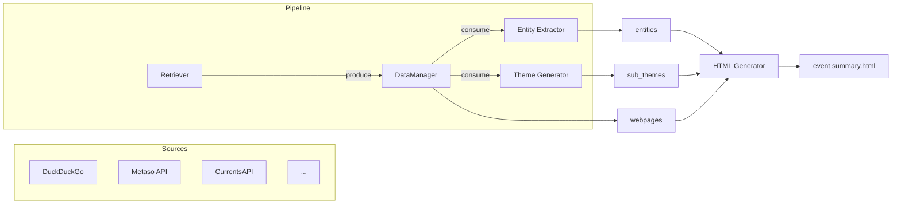

# Event Summary

> An async data pipeline that crawls multi-source information about any topic or event, extracts structured knowledge with LLMs, and generates a clean, interactive summary webpage.

[](https://www.python.org/downloads/)
[](LICENSE)

---

## Table of Contents

- [Why this design?](#why-this-design)
- [Architecture](#architecture)
- [Features](#features)
- [Quick Start](#quick-start)
  - [Environment](#environment)
  - [Configuration](#configuration)
  - [Run](#run)
- [Output](#output)
- [Integrating New Sources](#integrating-new-sources)
- [Project Structure](#project-structure)
- [License](#license)

---

## Why this design?

Researching an event usually means opening dozens of tabs, skimming articles, and manually taking notes. This pipeline automates the boring parts: it searches the web, fetches articles, extracts key entities (people, organizations, events, concepts), identifies sub-themes, and renders everything into a single-page report with a chronological timeline.

The architecture is built around two principles:
1. **Decouple acquisition from processing** — fetching is I/O-bound, LLM inference is throughput-bound; they should scale independently.
2. **Structured, not summarised** — instead of a single blob of text, the output is a typed knowledge graph (entities + themes) that can be rendered in multiple views.

---

## Architecture



### Core abstractions

| Component | Responsibility |
|-----------|--------------|
| **Retriever** | Discovers URLs, fetches raw content, enqueues them into `DataManager`. |
| **DataManager** | Dual `asyncio.Queue`s + thread-safe storage. Decouples producers from consumers. |
| **Processor** | Consumes webpages in batches, runs LLM prompts, and overrides global entity/theme state. |
| **HTML Generator** | Loads all `data/*.json` files and renders a sidebar-navigated static report. |

---

## Features

### Async Producer-Consumer Pipeline
- Retrievers fetch pages concurrently with configurable semaphores.
- Processors run in parallel, consuming from independent queues.
- Progress tracking via `tqdm` bars synchronized with queue depth.

### Pluggable Data Sources
- **DuckDuckGo Search** — zero-config, uses `ddgs` + `trafilatura` for clean text extraction.
- **Metaso API** — Chinese search engine with raw content included.
- **CurrentsAPI** — news-focused, supports date-range filtering.
- **RSS/Atom** — reference implementation (`data_pipeline/crawling/rss.py`) included for feed-based sources.

### LLM-Powered Structured Extraction
- **Entity Extractor** — iteratively maintains a typed entity list (Person, Organization, Location, Event, Concept, Method, Artifact) with deduplication.
- **Sub-theme Generator** — iteratively clusters content into at most 6 non-overlapping themes.
- Both processors use JSON-mode-like prompting with automatic retry on parse errors.

### Rich HTML Report
- Sidebar navigation across multiple queries.
- Four tabs per query: **Sub-themes**, **Entities**, **Chronological Summary**, **Sources**.
- Events are auto-sorted chronologically.
- Fully static — no server required.

---

## Quick Start

### Environment

We use `uv` for dependency management (recommended), but `pip` works too.

```bash
# uv (recommended)
uv sync

# or conda + pip
conda create -n event-summary python=3.12
conda activate event-summary
pip install -r requirements.txt
```

### Configuration

Copy the example environment file and fill in your keys:

```bash
cp .env.example .env
```

| Variable | Required for | Description |
|----------|-------------|-------------|
| `OPENAI_BASE_URL` / `OPENAI_API_KEY` / `OPENAI_MODEL` | LLM extraction | Any OpenAI-compatible endpoint. |
| `METASO_API_KEY` | Metaso source | Chinese search API key. |
| `CURRENTS_API_KEY` | Currents source | News API key. |

You can also pass API keys via CLI flags (`--metaso_api_key`, `--currents_api_key`).

### Run

1. **Collect data**

```bash
python -m data_pipeline "a certain topic or event"
```

This writes `data/<query>.json`.

2. **Generate HTML**

```bash
python -m html_generator
```

Open `event summary.html` in your browser.

---

## Output

The JSON output contains three top-level keys:

```json
{
  "webpages": [...],
  "entities": [...],
  "sub_themes": [...]
}
```

The HTML generator turns this into an interactive report where you can switch between queries in the sidebar and inspect themes, entities, a chronological event table, and raw sources.

---

## Integrating New Sources

The pipeline is designed so that adding a new data source is a matter of implementing a single abstract class. You don't need to refactor the core logic.

**The fastest way**: hand the task to your coding agent with [`CLAUDE.md`](CLAUDE.md). It contains the exact integration contract, a copy-paste template for a new `Retriever`, and a step-by-step checklist.

**In one sentence**: subclass `Retriever`, implement `_get_entries` and `_fetch`, export it from `data_pipeline/crawling/__init__.py`, and append it to the `retrievers` list in `data_pipeline/__main__.py`.

---

## Project Structure

```
event-summary/
├── data_pipeline/
│   ├── __main__.py              # CLI entry point
│   ├── models.py                # Retriever, Processor, DataManager
│   ├── utils.py                 # OpenAI-compatible LLM client
│   ├── crawling/                # Data source implementations
│   └── processing/              # LLM-based extractors & generators
├── html_generator/
│   ├── __main__.py              # Static site generator
│   └── template.html            # Jinja2 template
├── data/                        # JSON outputs
├── tests/                       # Async, LLM, and RSS tests
├── pyproject.toml
└── README.md
```

---

## License

[MIT](LICENSE)
